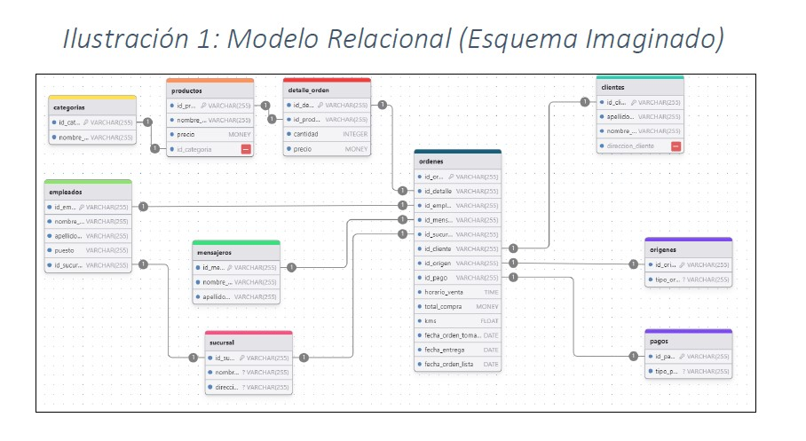
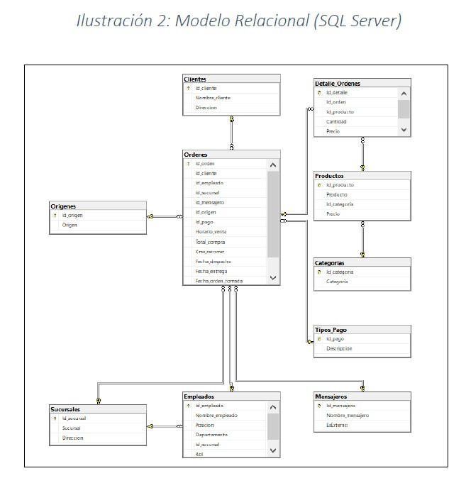

# Informe de Negocio: Fast-Food

El proyecto tiene como objetivo diseñar y desarrollar una base de datos relacional que permita gestionar de manera eficiente la información de “FastFood”, facilitando el acceso a datos clave sobre productos, clientes, órdenes y empleados. A través de la implementación de un esquema de base de datos bien estructurado, se busca optimizar las operaciones del negocio y mejorar la toma de decisiones estratégicas basadas en análisis de datos.

  

Objetivos Organizacionales Alcanzados:

• Se creó un modelo relacional que identifica las tablas y sus relaciones, logrando una estructura normalizada que minimiza la redundancia de datos. 

• Además, se establecieron siete tablas independientes (Categorías, Sucursales, Empleados, Clientes, Mensajeros, Orígenes y Tipos de Pago) y tres tablas dependientes (Órdenes, Detalle de la Orden y Productos).

• Las tablas fueron llenadas con datos relevantes, permitiendo la manipulación de información a través de sentencias SQL (INSERT, UPDATE, DELETE). Se realizó un seguimiento exhaustivo para asegurar que las tablas fueron correctamente pobladas y mantenidas.

• Se realizaron múltiples consultas, tanto básicas como complejas, para extraer información valiosa, incluyendo análisis de ventas, rendimiento de sucursales y eficiencia de empleados.

• La información analizada a partir de las consultas permitió a la organización identificar áreas de mejora, como la optimización de la logística de entrega, el aumento de ingresos a través de la aplicación móvil y la capacitación del personal.

  

En resumen, el desarrollo de la base de datos relacional ha proporcionado a la organización una herramienta poderosa para la gestión y análisis de información, permitiendo una mejor planificación y ejecución de estrategias operativas. La estructura creada no solo logró facilitar el manejo eficiente de los datos, sino que también promueve la sostenibilidad y escalabilidad del sistema en el futuro.

  

